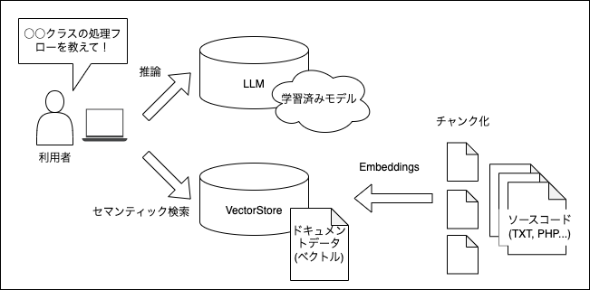

# ソースコードと会話する。未来の開発者体験

## :monocle_face: 課題感

- **ケース 1：** システムを引き継いだけどドキュメントが古い、もしくは存在しないため、ソースコードを直接トレースしないと中身がどうなっているか分からない。
- **ケース 2：** ソースコードを改善、リファクタリングしたいけどどこから手を付けたら良いか分からない。
- **ケース 3：** システムをドキュメント化したいけどソースコードが難解 & 複雑で読めない。

## :seedling: 解決策の提案

大規模言語モデル（LLM）とデータストア（VectorStore）による解析（いわゆる RAG 構成）をさせて、分からないことはソースコードに直接聞いてみれば良いじゃん！

## [WIP] 開発者向け

### システムアーキテクチャ

使用しているベクトル DB、LLM、外部リソース、サービス等を表現

### ソフトウェアアーキテクチャ

プログラムモジュールを表現

### 使い方

### 実行方法

### ローカル開発方法
